Solving the  RNA Folding Problem Using Integer Linear Programming

Table of Contents

1. Integer Linear Programming
2. The RNA Folding Problem
3. Formulation Of RNA Folding Into ILP Problem
4. Objective Function
   1. Constraints

## Integer Linear Programming:

Linear programming is a mathematical modelling technique, where the entire problem statement whatever it may be is boiled to maximization or minimization (basically optimization) of an objective function which must be linear i.e., the degree of the expression must be one, along with a set of linear constraints on the variables which can be equality constraints or inequality constraints. Basically, linear programming in a simple format can be expressed as follows,

    

where, 'A' is a column vector of size nx1 (let's say) of constants or weights corresponding to each variable in the objective function, 'x' is variable vector also of size nx1, 'D' and 'E' are constant square matrices of size nxn.

Integer linear programing, deals with the same optimization of an objective function over the given constraints, but the the major difference is that, in linear programming the variables need not be integers, but in the case of integer linear programming all the variables must be integers. Hence, in simple words integer linear programming is the optimization of an linear objective function, given a set of constraints on integer variables. So, on looking at the format of integer linear programming, it can be expressed as follows,

    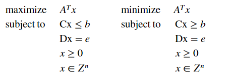

where, 'A' is a column vector of size nx1 (let's say) of constants or weights corresponding to each variable in the objective function, 'x' is variable vector also of size nx1, 'D' and 'E' are constant square matrices of size nxn.

## The RNA Folding Problem

### Formulation Of RNA Folding Into ILP Problem

As mentioned, RNA has folded structure of existance naturally, where a few of the nucleotides are bonded with each other in an optimized manner, in such a way that the number of binds or interactions present in a particular RNA sequence is maximized as much as possible, along with which a certain rules are to be obeyed while pairing. In order to solve the RNA folding problem using ILP, let us consider a binary variable P corresponding each and every pairs of nucleotide present in the given sequence, in such a way that the value of P(a,b) will be '1' if and only if there is an interaction possible between the  nucleotide and  nucleotide of the given nucleotide sequence and let us consider a matrix 'P' in order to store all the P(i,j) in an organised manner so as to make all P(i,j) values easily accesible. So 'P' is an upper triangular matrix without a diagonal if we store the neccesary variables alone. Let us understand this with an example. Let us consider an RNA sequence 'seq' which shall be as follows,

    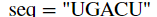

After assuming the sequence, we need to create the P containing the binary variables P(i,j). since there are 5 nucleotides present in the sequence we need to consider 5x5 matrix.

    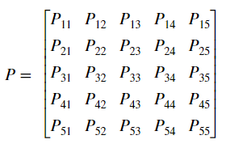

On observing the variables present in the matrix, we have a set of unnecesary variables populating the matrix. In the case of RNA folding problem, a nucleotide cannot be paired with itself, hence, the variables 'P(i,j)' where 'i' and 'j' are equal actually make no sense. Also, we can observe that there is a redundancy in the variables, for example, the variables P(1,2) and P(2,1) both actually represent the samething, which is the bond or pairing interactions between nucleotide at position 1 and 2, hence, in order to avoid this redundance let us consider only the upper triangular part of our matrix. Hence, the updated 'P' matrix turns out to be,

    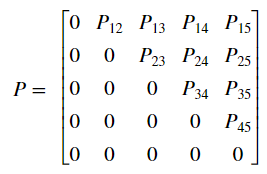

## Objective Function

Now, the main aim of RNA folding is stability, so, in order to increase the stability of a particular RNA sequence the number of pairings must be maximised as much as possible, which implied that the sum of all variables present in the 'P' matrix is supposed to be maximized, hence the objective function turns out to be,

The objective function of the sample sequence turns out to be as follows,

    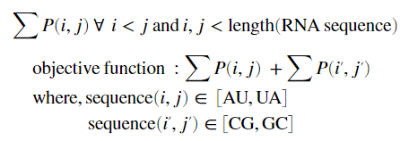

### Constraints

The constraints which the pairings are supposed to obey are as follows:

    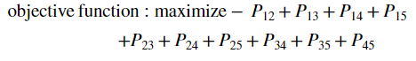

    

Constraint - 1

A nucleotide present in RNA sequence can only interact with it's complement present in the sequence. Hence, an 'A' present in the sequnce can be paired only with 'U' and vice-versa, in the same way, a 'C' can only be paired with 'G' and vice-versa. Here, we need to note that the above mentioned are the points where pairing is possible, it need not be that the pairing is compulsary in the above cases, the nucleotides may or may not be paired and that depends upon the forthcoming constraints. So, inorder to fulfill this constraint let us eliminate all the pairs among which pairing is not possible, which means we can make all the P(i,j) zero, where pairing is not possible.

<pre class="vditor-reset" placeholder="" contenteditable="true" spellcheck="false">

</pre>

Henceforth, we get the following constraints generated for our sequnce 'seq',

    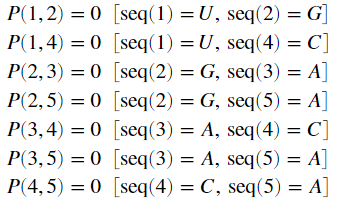

In order to make the calculations simple let us update our matrix 'P' and objective function by substituting the value of the above variables as zero. Hence, we get out 'P' matrix to be,

And the objective function to be,

    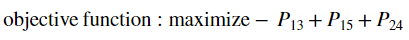

#### Constraint - 2

A nucleotide present in RNA sequence can be paired with only one other nucleotide present in the sequence. Which means that even if there are multiple complements corresponding to a particular nucleotide, it must be bonded with only one of them. The complement to which the nucleotide is to bonded is governed by the forthcoming set of constraints, the major purpose of this constraint is to limit the number of pairings corresponding to a particular nucleotide to one. In this case also we need to note that, pairing is not mandatory, but if a nucleotide is being paired it must be paired to only one other nucleotide.

    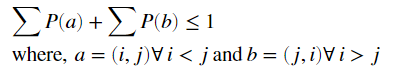

So, on taking sequence 'seq' as our example, we will be getting the following constraints,

    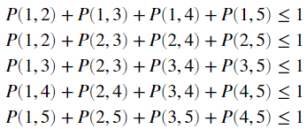

Now, on updating these constraint with the zero values obtained in the first constraint, we get the following,

    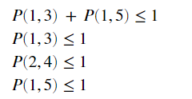

#### Constraint - 3

No two pairings or bonds present in an RNA sequence must cross each other, all the interactions must be in a nested manner. The main reason for this is that crossing or non-nested interactions may disturb each other and the net result may reduce the stability of the entire molecule. Adding to this, the compactness of a molecule also increases when it is nested, which in turn increases the stability of an RNA molecule. Let's assume for numbers a, b, c and d in such a way that  and all these four numbers are less than the length of RNA sequence. So, in order to ensure that no two bonds are crossing, we need to ensure that we don't have simultaneous interactions between seq(a),seq(c) and seq(b),seq(d), so only either of P(a,c) or P(b,d) can be one, for all values of a, b, c and d obeying the above mentioned restrictions.

    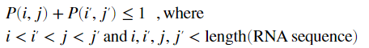

On applying this constraint to our sequence 'seq' we will get the following,

    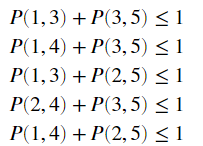

Now, on updating these constraint with the zero values obtained in the first constraint, we get the following,

    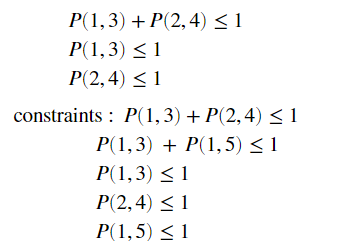

On solving these constraints and objective function we will get the following as our solution,

    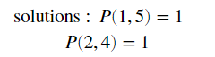

That is the folded structure of the sequence is in such a way that, the first nucleotide interacts with the fifth one and the second nuclotide interacts with the fourth one simultanously.

    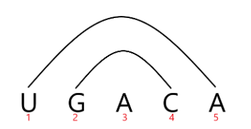

On pairing the corresponding nucleotides obtained in the solution, we can observe that all the constraints have been followed perfectly. Using this solution we can also generate the dot-bracket notation of the given RNA sequence. In the dot-bracket notation, every nucleotide which is not paired or which is not interacting with any other nucleotide  must be represented as a dot and the nucleotides which are paired are represented by brackets out of which the nucleotide which is closer to the beginning of a sequence is represented with open bracket '(' and the other nucleotide is represented using a closed bracket ')'.

The dot-bracket notation corresponding our example sequence 'seq' will be given as,	

    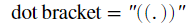

All the following constraints can also be generated and solved using the matlab sctipt. The script so written simply accepts the RNA sequence as an input and prints it's folded structure. The 'bioinformatics' toolbox of MATLAB is actually used in-order to print the folded structure obtained as a result of optimization which is performed. After performing optimization the solution is then used to generate the dot-bracket notation which is then used by the bioinformatics toolbox to print the structure.
